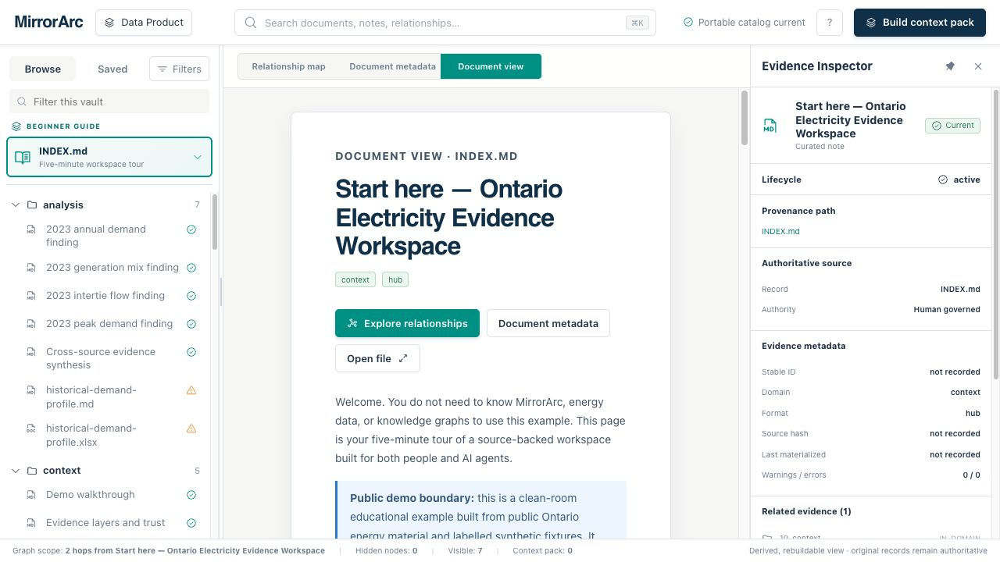
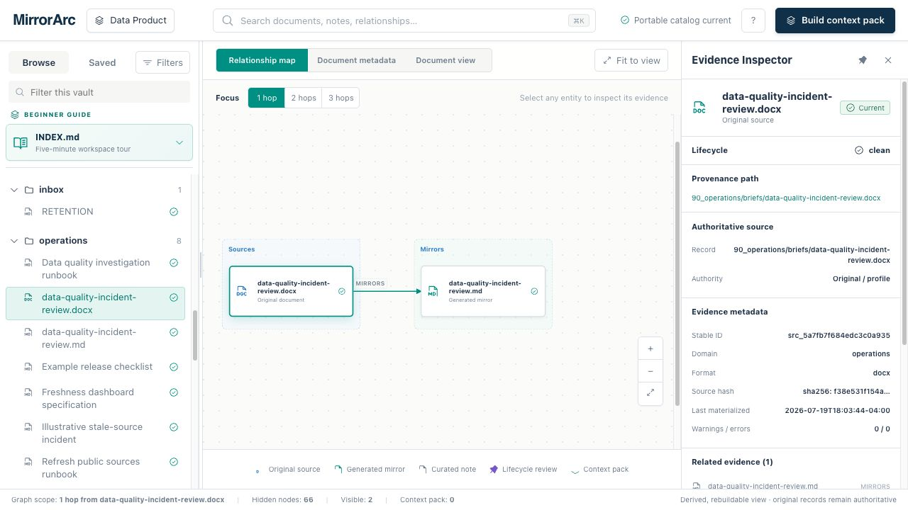
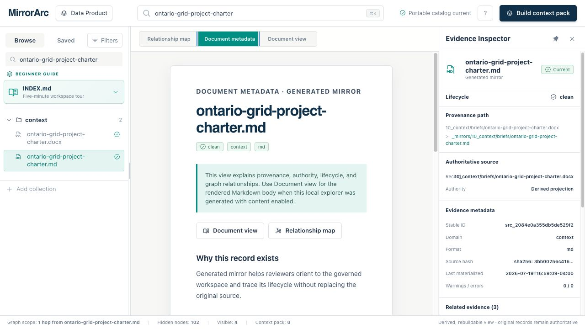

# MirrorArc

[](https://www.python.org/)
[](LICENSE)
[](#status)

**A governed documentation layer for both people and AI agents.**

**[Open the live Ontario Grid demo portal →](https://cz1993.github.io/MirrorArc/)**

MirrorArc is an open-source, local-first Python toolkit that turns changing Office files, PDFs,
GitHub repositories, datasets, and Markdown notes into a source-backed knowledge workspace. It
keeps original records authoritative, creates deterministic Markdown mirrors, connects evidence in
an explorable knowledge graph, and gives agents durable context without adding a vector database.



## Why MirrorArc exists

Teams do not need another chat window over a folder. They need a documentation layer that improves
as work progresses and remains inspectable after the chat ends.

| Common failure | MirrorArc's response |
| --- | --- |
| Contracts, decks, spreadsheets, repos, and notes stay isolated. | **Linking-first knowledge:** source, mirror, finding, decision, and runbook become navigable relationships. |
| AI documentation creates more files than anyone can govern. | **Anti-proliferation:** consolidate and update before creating; lint for structural drift and likely overlap. |
| Generated text quietly replaces the record it came from. | **Source-preserving mirrors:** originals remain authoritative; derived Markdown is content-hashed, refreshable, and reproducible. |
| Agent context disappears between sessions. | **Durable agent context:** Markdown, frontmatter, provenance, lifecycle state, and metadata-only context packs persist outside a model. |
| Sensitive or stale material enters an opaque index. | **Visible governance:** secrets-out, retention, licensing, PII boundaries, publication gates, and lifecycle warnings remain explicit. |

## See the connected evidence

The self-contained Catalog Explorer provides three complementary views: a relationship map, a
provenance and lifecycle inspector, and a rendered document view. The catalog panel is resizable,
long filenames wrap instead of disappearing, and `INDEX.md` is pinned as the beginner guide.





## Flagship demo: Ontario electricity evidence workspace

[`examples/ontario-electricity-evidence-vault/`](examples/ontario-electricity-evidence-vault/) is a 50+ file,
clean-room data-product example built from OGL Ontario data, metadata-only public references,
independently authored Word/Excel artifacts, and a synthetic repository fixture. It demonstrates:

- original Word, spreadsheet, and repository records connected to Markdown
  mirrors;
- contracts, pipelines, historical analysis, outputs, governance, and operations in one
  navigable workspace;
- explicit historical-data quality checks and a clear reuse boundary with exact provenance in
  [`examples/DATA_PROVENANCE.md`](examples/DATA_PROVENANCE.md).

The committed snapshot is an independently assembled educational corpus, not live grid data,
forecasting, alerts, or an affiliated Ontario energy product.

**[Launch the hosted demo](https://cz1993.github.io/MirrorArc/)** and start with the pinned
`INDEX.md` five-minute tour. GitHub Pages rebuilds this content-enabled portal only from the
provenance-documented public example and blocks deployment if the generated artifact fails the
repository's no-data scan or vault lint.

## Try the demo locally

```bash
git clone https://github.com/cz1993/MirrorArc.git
cd MirrorArc
python3.11 -m venv .venv
. .venv/bin/activate
python -m pip install -e .

mirrorarc --root examples/ontario-electricity-evidence-vault sync
mirrorarc --root examples/ontario-electricity-evidence-vault catalog --html --include-content
python -m http.server 8000 --directory examples/ontario-electricity-evidence-vault
```

Open `http://127.0.0.1:8000/CATALOG.html`. Start with the pinned `INDEX.md`, then follow the
five-minute tour. The `--include-content` output embeds bounded Markdown bodies and must remain
local for private or proprietary vaults. The hosted MirrorArc demo is a narrow exception: it is
built only from the public example corpus and scanned again before every deployment.

## How it works

1. **Plan** what will be mirrored without changing source records.
2. **Sync** supported Office files, PDFs, and repositories into machine-owned Markdown mirrors.
3. **Connect** mirrors to curated notes, contracts, findings, decisions, and runbooks.
4. **Inspect** content, provenance, lifecycle state, and relationships in Markdown, Obsidian, or the
   portable Catalog Explorer.
5. **Refresh** incrementally from observed source changes, with full sync retained for recovery and
   verification.

The default `data-product` profile covers sources, contracts, pipelines, analysis, models, outputs,
governance, and operations. Additional packaged profiles support business operations,
research/learning, software-project documentation, and minimal blank starts.

> Inspired by Andrej Karpathy's ["LLM wiki" pattern](https://gist.github.com/karpathy/442a6bf555914893e9891c11519de94f).
> See [`docs/positioning.md`](docs/positioning.md) for the product landscape and boundaries.

## Quick start

Create a vault without cloning MirrorArc itself. The installable command requires Python 3.11+;
`uvx` and `pipx run` will build an isolated environment when they can find a compatible Python.
Before the package is published to PyPI, use the Git URL:

```bash
uvx --from git+https://github.com/cz1993/MirrorArc.git mirrorarc init --profile data-product ~/my-data-product

# or, with pipx:
pipx run --spec git+https://github.com/cz1993/MirrorArc.git mirrorarc init --profile data-product ~/my-data-product
```

Once MirrorArc is published to PyPI, the equivalent short forms are
`uvx mirrorarc init --profile data-product ~/my-data-product` and
`pipx run mirrorarc init --profile data-product ~/my-data-product`.

For repeated local use, install the console command once:

```bash
uv tool install git+https://github.com/cz1993/MirrorArc.git
mirrorarc --version

# or, with pipx:
pipx install git+https://github.com/cz1993/MirrorArc.git
mirrorarc --version
```

Then open the vault in Obsidian if you want a human UI, point your agent at it (`CLAUDE.md` routes
all agents to `_meta/agent-rules.md`), and run the installed command from any folder:

```bash
mirrorarc --root ~/my-data-product doctor          # check dependencies and vault structure
mirrorarc --root ~/my-data-product plan            # inspect proposed mirror actions first
mirrorarc --root ~/my-data-product sync            # mirror Office files and configured repos
mirrorarc --root ~/my-data-product status          # review manifest-backed lifecycle state
mirrorarc --root ~/my-data-product sync --json     # machine-readable sync evidence for agents/pilots
mirrorarc --root ~/my-data-product status --json   # machine-readable lifecycle status
mirrorarc --root ~/my-data-product doctor --json   # machine-readable preflight report
mirrorarc --root ~/my-data-product conversion --guide   # read-only conversion spot-check + guide
mirrorarc --root ~/my-data-product conversion --init-results # private quality review scaffold
mirrorarc --root ~/my-data-product conversion --results _meta/conversion-quality-results.yml --require-reviewed # after filling scaffold
mirrorarc --root ~/my-data-product migration       # dry-run report for legacy/unknown folders
mirrorarc --root ~/my-data-product migration --runbook  # legacy folder move protocol
mirrorarc --root ~/my-data-product migration --normalize-frontmatter-domains --worksheet # review domain alias cleanup
mirrorarc --root ~/my-data-product recovery --worksheet # review manifest recovery actions
mirrorarc --root ~/my-data-product sandbox --source-root /path/to/original-documents
mirrorarc --root ~/my-data-product catalog         # generate CATALOG.md inventory gateway
mirrorarc --root ~/my-data-product catalog --html  # generate the interactive CATALOG.html explorer
mirrorarc --root ~/my-data-product catalog --html --include-content # local content-review portal
mirrorarc --root ~/my-data-product m365            # Microsoft 365/Copilot handoff readiness
mirrorarc --root ~/my-data-product review --json   # summarize metadata-only human review decisions
mirrorarc --root ~/my-data-product overlap         # calibrate overlap thresholds without note bodies
mirrorarc --root ~/my-data-product pilot           # aggregate pilot evidence, no source content
mirrorarc --root ~/my-data-product pilot --worksheet    # redacted Markdown private-pilot summary
mirrorarc --root ~/my-data-product benchmark            # validate agent-readiness task pack, if present
mirrorarc --root ~/my-data-product benchmark --init-tasks    # create private task scaffold
mirrorarc --root ~/my-data-product benchmark --worksheet     # print private benchmark run sheet
mirrorarc --root ~/my-data-product benchmark --init-results  # create private result scaffold
mirrorarc --root ~/my-data-product benchmark --results _meta/agent-readiness-results.yml --require-prompt-safety # after scoring
# edit tools/repos.yml, then:
mirrorarc --root ~/my-data-product sync           # mirror configured GitHub repos too
mirrorarc --root ~/my-data-product lint           # health check
```

Run `sandbox` from a duplicated pilot vault, not the original document folder. It is read-only and
checks copy-boundary, mirror isolation, manifest/recovery readiness, and basic backup posture
without printing source paths or document text.

Use `review` after spot-checking mirrors, catalogs, or handoff reports. It appends metadata-only
decisions to `_meta/review-ledger.jsonl` with artifact hashes, so later changes are reported as
stale reviews instead of silently preserving old approvals.

The generated `CATALOG.html` is a self-contained Catalog Explorer. It opens on `INDEX.md`, offers
separate relationship-map, document-metadata, and rendered-document views, preserves explicit
original-to-mirror lineage, and keeps local context-pack exports metadata-only. The safe default
does not embed document bodies. Use `catalog --html --include-content` only for a local review copy;
that opt-in mode embeds bounded Markdown and generated-mirror bodies, so the resulting HTML must be
protected like the vault itself. The public GitHub Pages demo is built from the explicitly public,
provenance-documented example and passes the no-data gate before deployment. Neither mode requires
an application server or creates an evidence index.

Source checkout fallback:

```bash
git clone https://github.com/cz1993/MirrorArc.git mirrorarc && cd mirrorarc
python3.11 -m pip install -e .
mirrorarc --version
mirrorarc profile list
mirrorarc init --profile data-product ~/my-data-product
mirrorarc init --profile business-operations ~/my-business-vault
mirrorarc init --profile research-learning ~/my-research-vault
mirrorarc init --profile software-project ~/my-software-vault
mirrorarc init --profile blank ~/my-blank-vault
mirrorarc --root ~/my-data-product profile validate
mirrorarc --root ~/my-data-product profile diff 0.1.0
mirrorarc --root ~/my-data-product profile migrate --plan
mirrorarc --root ~/my-data-product profile migrate --write
mirrorarc --root ~/my-data-product profile views --check
mirrorarc --root ~/my-data-product migrate annotations --plan
mirrorarc --root ~/my-data-product plan
```

The packaged v1 profiles are `data-product` (the default), `business-operations`,
`research-learning`, `software-project`, and `blank`. Each initializes from the installable
package with profile-owned folders, `_meta/profile.yml`, generated scaffold docs, and only the
templates declared by its contract.

Profile contract details: [`docs/PROFILE_SCHEMA.md`](docs/PROFILE_SCHEMA.md).

Step-by-step: [`docs/quickstart.md`](docs/quickstart.md).

## Documentation

- [Product contract](docs/PRODUCT.md) — audience, workflow, outcomes, and non-goals.
- [Quickstart](docs/quickstart.md) — demo-first setup and daily workflow.
- [Sync specification](docs/SYNC_SPEC.md) — authority, mirroring, manifests, and refresh behavior.
- [Security model](docs/SECURITY_MODEL.md) — trust boundaries, prompt safety, and local-review rules.
- [Profile schema](docs/PROFILE_SCHEMA.md) — configurable domains, note types, folders, and policies.
- [Methodology](docs/methodology.md) and [whitepaper](docs/MIRRORARC_WHITEPAPER.md) — detailed design
  rationale and professional review brief.
- [Positioning](docs/positioning.md) — where MirrorArc fits relative to LLM wikis, RAG, PKM, and
  document-management tools.

## Status

**v0 - technical alpha.** The template vault, schema, thin tool CLI, source-installable console
entry point, sync/lint tools, the Ontario Electricity flagship example, safety guards, Office/repo
manifests, audit logs, journaled changed-file materialization, and all five official profile init
fixtures work today.
Full sync remains the baseline and recovery path; journaled incremental operation is the
steady-state changed-file path.

## License

MirrorArc is licensed under the GNU Affero General Public License v3.0 or later for the open
core, with a separate **commercial license** planned for enterprise/closed use and consulting.
`LICENSE` contains the full AGPL-3.0 text; commercial terms and contribution policy still require
owner/counsel finalization before accepting outside contributions. See [`LICENSING.md`](LICENSING.md).
"MirrorArc" is a trademark — see [`TRADEMARK.md`](TRADEMARK.md).

## Credits

The "LLM wiki" pattern (Andrej Karpathy), [markitdown](https://github.com/microsoft/markitdown)
(Microsoft), and [Obsidian](https://obsidian.md). Interoperates with — rather than competes with —
tools like [basic-memory](https://github.com/basicmachines-co/basic-memory) and Copilot for
Obsidian.
