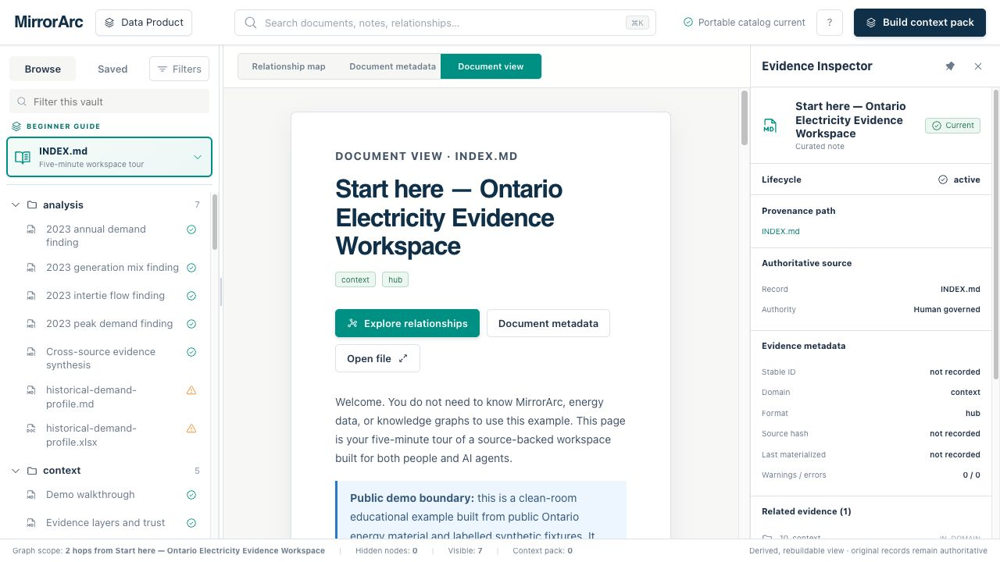
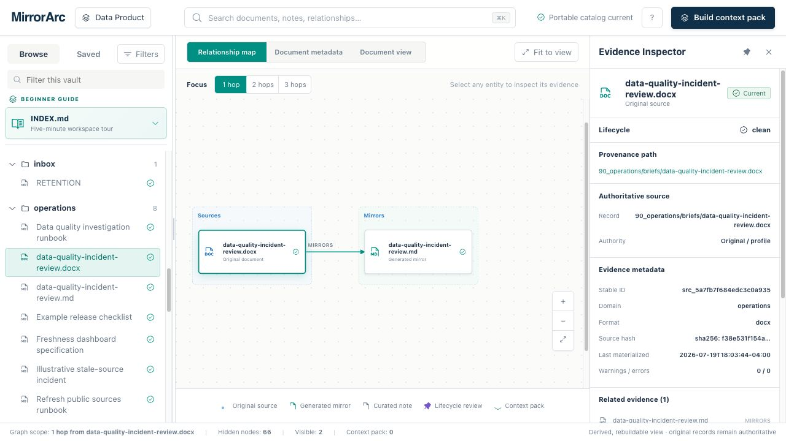
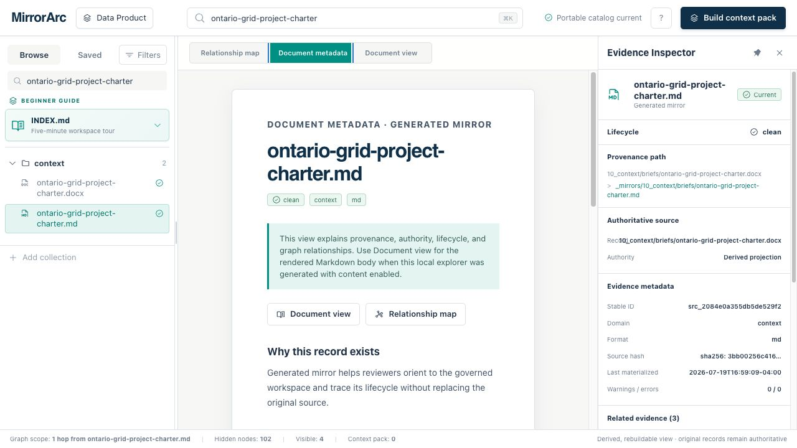

# MirrorArc

[](https://www.python.org/)
[](LICENSE)
[](#status)

**Preserve sources. Minimize derived documents. Generate knowledge views when they are needed.**

**[Open the live Ontario Grid demo portal →](https://cz1993.github.io/MirrorArc/)**

MirrorArc is an open-source, local-first Python toolkit that turns changing Office files, PDFs,
GitHub repositories, datasets, and Markdown into a governed knowledge-projection system. It keeps
original records authoritative, creates deterministic Markdown projections for opaque sources,
maintains source-backed relationships, and renders human or agent context without adding a vector
database or an AI-generated wiki.



## Why MirrorArc exists

Generative AI made documentation fast and cheap to create. It did not make a growing collection of
summaries, entity pages, hubs, and agent notes cheap to verify or maintain. MirrorArc treats every
durable derivative as a liability that must justify its existence; the information and knowledge
carried by the sources remain the asset.

The product principle is:

> **Preserve authoritative records. Treat every durable derivative as a maintenance liability.
> Generate views instead of accumulating documents.**

| Common failure | MirrorArc's response |
| --- | --- |
| Office files, PDFs, spreadsheets, repos, and Markdown stay isolated. | **L1 specular projections:** opaque sources receive stable, source-addressed Markdown read models while originals remain authoritative. |
| AI documentation creates more files than anyone can govern. | **Anti-proliferation by architecture:** relationships are data and synthesis is a view, not another note by default. |
| Cross-document meaning is hidden or asserted without evidence. | **Relationship and provenance ledger:** typed connections carry evidence anchors, hashes, generation method, confidence, and review state. |
| Human readers need interpretation rather than raw extraction. | **L2 knowledge views:** many sources produce a few purpose- and audience-specific reading surfaces that are ephemeral unless pinned or reviewed. |
| Source changes leave summaries and agent context stale. | **Dependency-aware refresh:** changed sources invalidate only affected projections, relationships, views, reviews, and context. |
| Sensitive or stale material enters an opaque index. | **Visible governance:** authority, licensing, PII boundaries, lifecycle, freshness, and publication gates remain explicit. |

## See the connected evidence

The self-contained Catalog Explorer provides a relationship map, a provenance and lifecycle
inspector, and a rendered document view. When a governed repository is selected, an optional Code
view adds revision-bound source evidence, call paths, impact, and affected-test candidates. The
catalog panel is resizable, long filenames wrap instead of disappearing, and `INDEX.md` is pinned
as the beginner guide.





## Flagship demo: Ontario electricity evidence workspace

[`examples/ontario-electricity-evidence-vault/`](examples/ontario-electricity-evidence-vault/) is the
flagship clean-room data-product example, built from OGL Ontario data, metadata-only public
references, independently authored Word/Excel artifacts, and a synthetic repository fixture. The
current snapshot demonstrates the implemented L1, lifecycle, catalog, and portal foundation. Its
large hand-authored Markdown layer predates the knowledge-projection architecture and is now a
migration fixture rather than the target output.

The local implementation supports source-addressed L1, evidence relationships, reviewed L2 views,
dynamic/frozen context, and dependency invalidation. The checked-in example remains deliberately
small. Historical stress tests are recorded separately; current batch proof is documented in the
Trustworthy Context handoff when available.

The committed snapshot is an independently assembled educational corpus, not live grid data,
forecasting, alerts, or an affiliated Ontario energy product.

**[Launch the hosted demo](https://cz1993.github.io/MirrorArc/)** and start with the pinned
`INDEX.md` five-minute tour. GitHub Pages rebuilds this content-enabled portal only from the
provenance-documented public example and blocks deployment unless both the repository-wide
provenance/no-data gate and the generated-artifact scan pass alongside vault lint.

The hosted project is progressively discoverable: the
[`project overview`](https://cz1993.github.io/MirrorArc/project/) identifies MirrorArc's purpose,
differentiators, installation path, licence, and canonical GitHub source in semantic HTML. The
demo's initial HTML contains the rendered beginner tour, while
[`documents/`](https://cz1993.github.io/MirrorArc/documents/) provides one semantic, no-JavaScript
page per public record. Search and agent discovery surfaces include
[`sitemap.xml`](https://cz1993.github.io/MirrorArc/sitemap.xml),
[`robots.txt`](https://cz1993.github.io/MirrorArc/robots.txt),
[`llms.txt`](https://cz1993.github.io/MirrorArc/llms.txt), raw public Markdown, and a metadata-only
[`catalog.json`](https://cz1993.github.io/MirrorArc/catalog.json).

## Try the demo locally

```bash
git clone https://github.com/cz1993/MirrorArc.git
cd MirrorArc
python3.11 -m venv .venv
. .venv/bin/activate
python -m pip install -e .

mirrorarc --root examples/ontario-electricity-evidence-vault sync
mirrorarc --root examples/ontario-electricity-evidence-vault code doctor
# If Ready, optionally analyze the synthetic repository fixture:
mirrorarc --root examples/ontario-electricity-evidence-vault code analyze --repo repo_252e1077b0082592ba3d --symbol demand_change
mirrorarc --root examples/ontario-electricity-evidence-vault catalog --html --include-content
python -m http.server 8000 --directory examples/ontario-electricity-evidence-vault
```

Open `http://127.0.0.1:8000/CATALOG.html`. Start with the pinned `INDEX.md`, then follow the
five-minute tour. The `--include-content` output embeds bounded Markdown bodies and must remain
local for private or proprietary vaults. The hosted MirrorArc demo is a narrow exception: it is
built only from the public example corpus and scanned again before every deployment.

## Choose a task and export its evidence

From a synced vault, choose a task, inspect what was selected and omitted, then freeze evidence:

```bash
mirrorarc --root <vault> context build --lens orientation --mode metadata --query "inspection interval" --json
mirrorarc --root <vault> context build --lens orientation --query "inspection interval" --name inspection-review
# Use the definition ID printed above:
mirrorarc --root <vault> context resolve <definition-id> --json
mirrorarc --root <vault> context freeze --definition <definition-id> --task "Explain the inspection interval with citations."
mirrorarc --root <vault> catalog --html
```

Query retrieval is opt-in: lexical ranking can miss relevant evidence. Inspect source hashes,
exact spans, selected/excluded reasons, warnings and omissions before use. Metadata contains
references only. Frozen packs include bounded evidence and report exact serialized bytes plus an
estimated token count, not a model-independent token guarantee. A tiny budget can fail because
instructions and citations alone do not fit. `offline_complete` is false if selected evidence is
missing or truncated; it is never a guarantee that the sources answer your question.

The portable Catalog's selection download stays metadata-only. Its governed-context panel shows
saved tasks, copyable commands and frozen status. HTML does not execute those commands. Use
`--include-content` only when intentionally embedding local evidence; protect the resulting file
according to its sensitivity. Source changes require refresh, context resolution, and Catalog
regeneration. Frozen bytes remain unchanged and status reports staleness.

## Review PDF page evidence

The optional PageIndex integration adds physical-page evidence and unreviewed answer candidates to
the same governed workflow. Install its separate pinned runtime using the
[PageIndex setup and review guide](docs/PAGEINDEX.md), then start with model-free indexing:

```bash
mirrorarc --root /absolute/path/to/copied-vault document doctor
# Use a registered PDF source ID from mirrorarc status --json:
mirrorarc --root /absolute/path/to/copied-vault document index --source SOURCE_ID --context frozen --page 2
mirrorarc --root /absolute/path/to/copied-vault catalog --html --include-content
```

In the Catalog, select the PDF, then **Document metadata → PDF page evidence**. Optional questions
require an approved model/endpoint and explicit per-command consent; indexing alone does not create
an answer. Answer review shows frozen cited excerpts, current/stale state and uncertainty. A valid
page address does not establish that a claim is supported. The [local results](docs/PAGEINDEX_RESULTS.md)
separate tested behavior from real-model quality, owner acceptance and release readiness.

## How it works

1. **Register** authoritative sources without changing them.
2. **Project** each opaque source into one stable, machine-owned L1 Markdown read model.
3. **Connect** evidence through typed relationships with provenance and review state rather than
   creating more notes.
4. **Interpret** many sources through a small number of purpose-specific L2 knowledge views.
5. **Assemble** dynamic or frozen context for a human review or agent task.
6. **Refresh** only affected projections and dependants when sources change, with reconciliation
   and full sync retained for recovery and verification.

The default `data-product` profile covers sources, contracts, pipelines, analysis, models, outputs,
governance, and operations. Additional packaged profiles support business operations,
research/learning, software-project documentation, and minimal blank starts.

> Inspired by Andrej Karpathy's ["LLM wiki" pattern](https://gist.github.com/karpathy/442a6bf555914893e9891c11519de94f).
> See [`docs/positioning.md`](docs/positioning.md) for the product landscape and boundaries.

## Quick start

Create a vault without cloning MirrorArc itself. The installable command requires Python 3.11+;
`uvx` and `pipx run` will build an isolated environment when they can find a compatible Python.
Before the package is published to PyPI, use the Git URL:

```bash
uvx --from git+https://github.com/cz1993/MirrorArc.git mirrorarc init --profile data-product ~/my-data-product

# or, with pipx:
pipx run --spec git+https://github.com/cz1993/MirrorArc.git mirrorarc init --profile data-product ~/my-data-product
```

Once MirrorArc is published to PyPI, the equivalent short forms are
`uvx mirrorarc init --profile data-product ~/my-data-product` and
`pipx run mirrorarc init --profile data-product ~/my-data-product`.

For repeated local use, install the console command once:

```bash
uv tool install git+https://github.com/cz1993/MirrorArc.git
mirrorarc --version

# or, with pipx:
pipx install git+https://github.com/cz1993/MirrorArc.git
mirrorarc --version
```

Then open the vault in Obsidian if you want a human UI, point your agent at it (`CLAUDE.md` routes
all agents to `_meta/agent-rules.md`), and run the installed command from any folder:

```bash
mirrorarc --root ~/my-data-product doctor          # check dependencies and vault structure
mirrorarc --root ~/my-data-product plan            # inspect proposed mirror actions first
mirrorarc --root ~/my-data-product sync            # mirror Office files and configured repos
mirrorarc --root ~/my-data-product status          # review manifest-backed lifecycle state
mirrorarc --root ~/my-data-product sync --json     # machine-readable sync evidence for agents/pilots
mirrorarc --root ~/my-data-product status --json   # machine-readable lifecycle status
mirrorarc --root ~/my-data-product doctor --json   # machine-readable preflight report
mirrorarc --root ~/my-data-product conversion --guide   # read-only conversion spot-check + guide
mirrorarc --root ~/my-data-product conversion --init-results # private quality review scaffold
mirrorarc --root ~/my-data-product conversion --results _meta/conversion-quality-results.yml --require-reviewed # after filling scaffold
mirrorarc --root ~/my-data-product migration       # dry-run report for legacy/unknown folders
mirrorarc --root ~/my-data-product migration --runbook  # legacy folder move protocol
mirrorarc --root ~/my-data-product migration --normalize-frontmatter-domains --worksheet # review domain alias cleanup
mirrorarc --root ~/my-data-product recovery --worksheet # review manifest recovery actions
mirrorarc --root ~/my-data-product sandbox --source-root /path/to/original-documents
mirrorarc --root ~/my-data-product catalog         # generate CATALOG.md inventory gateway
mirrorarc --root ~/my-data-product catalog --html  # generate the interactive CATALOG.html explorer
mirrorarc --root ~/my-data-product catalog --html --include-content # local content-review portal
mirrorarc --root ~/my-data-product code doctor     # optional local repository-analysis readiness
mirrorarc --root ~/my-data-product code analyze --repo <repo-id> # bounded revision evidence
mirrorarc --root ~/my-data-product code status --json # current/stale/failed analysis state
mirrorarc --root ~/my-data-product m365            # Microsoft 365/Copilot handoff readiness
mirrorarc --root ~/my-data-product review --json   # summarize metadata-only human review decisions
mirrorarc --root ~/my-data-product overlap         # calibrate overlap thresholds without note bodies
mirrorarc --root ~/my-data-product pilot           # aggregate pilot evidence, no source content
mirrorarc --root ~/my-data-product pilot --worksheet    # redacted Markdown private-pilot summary
mirrorarc --root ~/my-data-product benchmark            # validate agent-readiness task pack, if present
mirrorarc --root ~/my-data-product benchmark --init-tasks    # create private task scaffold
mirrorarc --root ~/my-data-product benchmark --worksheet     # print private benchmark run sheet
mirrorarc --root ~/my-data-product benchmark --init-results  # create private result scaffold
mirrorarc --root ~/my-data-product benchmark --results _meta/agent-readiness-results.yml --require-prompt-safety # after scoring
# edit tools/repos.yml, then:
mirrorarc --root ~/my-data-product sync           # mirror configured GitHub repos too
mirrorarc --root ~/my-data-product lint           # health check
```

Run `sandbox` from a duplicated pilot vault, not the original document folder. It is read-only and
checks copy-boundary, mirror isolation, manifest/recovery readiness, and basic backup posture
without printing source paths or document text.

Use `review` after spot-checking mirrors, catalogs, or handoff reports. It appends metadata-only
decisions to `_meta/review-ledger.jsonl` with artifact hashes, so later changes are reported as
stale reviews instead of silently preserving old approvals.

The generated `CATALOG.html` is a self-contained Catalog Explorer. It opens on `INDEX.md`, offers
separate relationship-map, document-metadata, rendered-document, and contextual Code views,
preserves explicit original-to-mirror lineage, and keeps local context-pack exports metadata-only.
Repository analysis runs before generation; the passive HTML never starts a process or fetches
data. The safe default
does not embed document bodies. Use `catalog --html --include-content` only for a local review copy;
that opt-in mode embeds bounded Markdown and generated-mirror bodies, so the resulting HTML must be
protected like the vault itself. The public GitHub Pages demo is built from the explicitly public,
provenance-documented example and passes the no-data gate before deployment. Neither mode requires
an application server or creates an evidence index.

Source checkout fallback:

```bash
git clone https://github.com/cz1993/MirrorArc.git mirrorarc && cd mirrorarc
python3.11 -m pip install -e .
mirrorarc --version
mirrorarc profile list
mirrorarc init --profile data-product ~/my-data-product
mirrorarc init --profile business-operations ~/my-business-vault
mirrorarc init --profile research-learning ~/my-research-vault
mirrorarc init --profile software-project ~/my-software-vault
mirrorarc init --profile blank ~/my-blank-vault
mirrorarc --root ~/my-data-product profile validate
mirrorarc --root ~/my-data-product profile diff 0.2.0
mirrorarc --root ~/my-data-product profile migrate --plan
mirrorarc --root ~/my-data-product profile migrate --write
mirrorarc --root ~/my-data-product profile views --check
mirrorarc --root ~/my-data-product migrate annotations --plan
mirrorarc --root ~/my-data-product plan
```

The packaged v1 profiles are `data-product` (the default), `business-operations`,
`research-learning`, `software-project`, and `blank`. Each initializes from the installable
package with profile-owned folders, `_meta/profile.yml`, generated scaffold docs, and only the
templates declared by its contract.

Profile contract details: [`docs/PROFILE_SCHEMA.md`](docs/PROFILE_SCHEMA.md).

Step-by-step: [`docs/quickstart.md`](docs/quickstart.md).

## Documentation

- [PageIndex document review](docs/PAGEINDEX.md) — optional PDF structure, physical-page context,
  explicit model approval and unreviewed cited answers; currently under local validation.
- [PageIndex release plan](docs/PAGEINDEX_RELEASE_PLAN.md) — current integration and acceptance gates.
- [Whitepaper](docs/MIRRORARC_WHITEPAPER.md) — canonical product thesis, authority model, and
  knowledge-projection architecture.
- [Product implementation plan](docs/PRODUCT_IMPLEMENTATION_PLAN.md) — sequenced development,
  migration, test, Ontario corpus, and portal finish line.
- [New-session execution prompt](docs/prompts/KNOWLEDGE_PROJECTION_KICKOFF.md) — paste-ready prompt
  for pursuing the implementation plan in a clean session.
- [Repository Intelligence execution plan](docs/CODE_INTELLIGENCE_EXECUTION_PLAN.md) — implemented
  CodeGraph-backed code evidence, CLI, context, Catalog, and local proof record.
- [Repository Intelligence kickoff prompt](docs/prompts/CODE_INTELLIGENCE_EXECUTION_KICKOFF.md) —
  goal-mode prompt for implementing that plan without ADS or a review dependency.

The whitepaper defines architectural principles; the current
[Trustworthy Context plan](docs/TRUSTWORTHY_CONTEXT_EXECUTION_PLAN.md) governs this local batch.
Earlier implementation plans record historical evidence, not current acceptance.

- [Product contract](docs/PRODUCT.md) — audience, workflow, outcomes, and non-goals.
- [Quickstart](docs/quickstart.md) — demo-first setup and daily workflow.
- [Sync specification](docs/SYNC_SPEC.md) — authority, mirroring, manifests, and refresh behavior.
- [Security model](docs/SECURITY_MODEL.md) — trust boundaries, prompt safety, and local-review rules.
- [Profile schema](docs/PROFILE_SCHEMA.md) — configurable domains, note types, folders, and policies.
- [Methodology](docs/methodology.md) — L0/L1, relationships, L2, context, review, and promotion
  discipline.
- [Positioning](docs/positioning.md) — where MirrorArc fits relative to LLM wikis, RAG, PKM, and
  document-management tools.

## Status

**v0 - technical alpha.** Source-preserving L1 mirrors, manifests, lifecycle state, audit logs,
journaled changed-file materialization, reconciliation, full recovery sync, profiles, lint/safety
guards, the portable catalog, stable projection identities, and the versioned evidence-backed
relationship ledger work today.

Dependency invalidation, L2 knowledge views, dynamic/frozen context assembly, and optional
revision-bound Repository Intelligence are implemented locally. The current Ontario example is
retained as migration and regression evidence; do not interpret its curated Markdown count as the
target MirrorArc model. This remains a technical alpha, and local proof is not hosted or production
proof.

## License

MirrorArc is licensed under the GNU Affero General Public License v3.0 or later for the open
core, with a separate **commercial license** planned for enterprise/closed use and consulting.
`LICENSE` contains the full AGPL-3.0 text; commercial terms and contribution policy still require
owner/counsel finalization before accepting outside contributions. See [`LICENSING.md`](LICENSING.md).
"MirrorArc" is a trademark — see [`TRADEMARK.md`](TRADEMARK.md).

## Credits

The "LLM wiki" pattern (Andrej Karpathy), [markitdown](https://github.com/microsoft/markitdown)
(Microsoft), and [Obsidian](https://obsidian.md). Interoperates with — rather than competes with —
tools like [basic-memory](https://github.com/basicmachines-co/basic-memory) and Copilot for
Obsidian.
